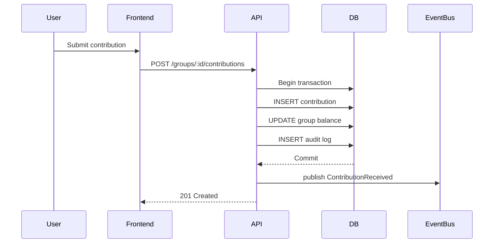
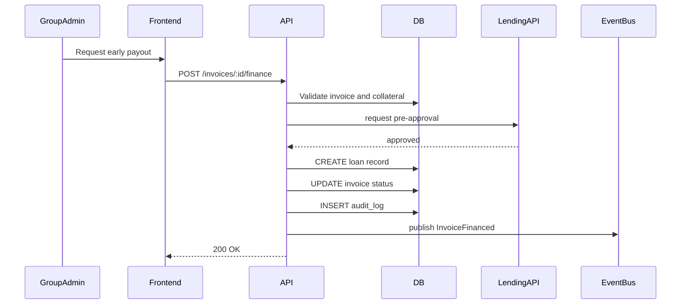

# Software Design Document (SDD)

## 1. Executive Summary

This document describes the first MVP for a financial infrastructure platform that upgrades informal groups and SMEs into creditworthy entities. The platform combines recordkeeping, governance, analytics, transaction plumbing, and financing integration to deliver financial legitimacy and access to capital.

---


## 2. MVP Features

- User authentication and group registration
- Group member management and roles
- Contribution logging and savings ledger
- Basic governance: roles, proposal creation, voting
- Invoice capture and receivable tracking
- Dashboard with cashflow and contribution history
- Member reliability scoring and simple group credit score
- M-Pesa integration for payments and reconciliation
- Early payout / invoice financing workflow
- API-level authorization and input validation
- Audit trail and transaction logging

---

## 3. Audience

Primary target users:
- Informal savings groups (chamas)
- Student groups and community cooperatives
- Micro and small enterprises (SMEs)

User needs:
- Simple recordkeeping for contributions and loans
- Transparent governance and rule enforcement
- Access to short-term cash and invoice financing
- Proof of financial behavior for future credit

---

## 4. System Flow Description

1. User registers and creates/joins a group.
2. Members are assigned roles and permissions.
3. Contributions are recorded through manual entry or M-Pesa callback.
4. Group rules are configured and proposals submitted.
5. Invoices or receivables are registered as assets.
6. Analytics compute cashflow, reliability scores, and creditworthiness.
7. Financing partners review the group profile and may offer early payouts or loans.
8. Transactions flow through external APIs and are reconciled in the ledger.
9. Events update dashboards, notifications, and audit logs.

---

## 5. Functional Requirements

- FR1: The system must allow user registration and secure login.
- FR2: The system must allow group creation, member invitations, and role assignment.
- FR3: The system must record contributions, loans, repayments, and invoices.
- FR4: The system must enforce role-based permissions for governance actions.
- FR5: The system must calculate member reliability and group credit scores.
- FR6: The system must integrate with M-Pesa and external lending APIs.
- FR7: The system must support invoice financing / early payouts.
- FR8: The system must provide audit trails for all financial events.
- FR9: The system must validate all input and reject invalid requests.
- FR10: The system must log errors and provide meaningful failure responses.

---

## 6. System Architecture

### 6.1 Tech stack

Backend:
- Node.js + Express
- PostgreSQL
- Redis
- Sequelize / TypeORM / Prisma
- RabbitMQ / BullMQ for background jobs

Frontend:
- React or Next.js
- Tailwind CSS
- Authentication flows with JWT / session cookies

Infrastructure:
- Heroku platform
- Heroku Postgres
- Heroku Redis
- Heroku Scheduler for background jobs
- M-Pesa API gateway
- External lending API integration
- Log drain / centralized logging

### 6.2 Database schema

Entities:
- users
- groups
- group_memberships
- roles
- permissions
- contributions
- invoices
- loans
- payments
- proposals
- votes
- score_history
- audit_logs

Example schema definitions:

```sql
CREATE TABLE users (
  id uuid PRIMARY KEY,
  email text UNIQUE NOT NULL,
  phone text UNIQUE NOT NULL,
  name text NOT NULL,
  password_hash text NOT NULL,
  created_at timestamptz DEFAULT now()
);

CREATE TABLE groups (
  id uuid PRIMARY KEY,
  name text NOT NULL,
  description text,
  legal_status text,
  created_at timestamptz DEFAULT now()
);

CREATE TABLE group_memberships (
  id uuid PRIMARY KEY,
  group_id uuid REFERENCES groups(id) ON DELETE CASCADE,
  user_id uuid REFERENCES users(id) ON DELETE CASCADE,
  role text NOT NULL,
  joined_at timestamptz DEFAULT now(),
  active boolean DEFAULT true
);

CREATE TABLE contributions (
  id uuid PRIMARY KEY,
  group_id uuid REFERENCES groups(id) ON DELETE CASCADE,
  user_id uuid REFERENCES users(id),
  amount numeric CHECK (amount > 0),
  channel text NOT NULL,
  external_reference text,
  status text NOT NULL DEFAULT 'pending',
  recorded_at timestamptz DEFAULT now()
);

CREATE TABLE invoices (
  id uuid PRIMARY KEY,
  group_id uuid REFERENCES groups(id) ON DELETE CASCADE,
  supplier text NOT NULL,
  customer text NOT NULL,
  amount numeric CHECK (amount > 0),
  due_date date NOT NULL,
  status text NOT NULL DEFAULT 'registered',
  created_at timestamptz DEFAULT now()
);

CREATE TABLE loans (
  id uuid PRIMARY KEY,
  group_id uuid REFERENCES groups(id) ON DELETE CASCADE,
  amount numeric CHECK (amount > 0),
  collateral jsonb,
  status text NOT NULL DEFAULT 'draft',
  disbursed_at timestamptz,
  due_date date,
  created_at timestamptz DEFAULT now()
);

CREATE TABLE audit_logs (
  id uuid PRIMARY KEY,
  entity text NOT NULL,
  entity_id uuid,
  action text NOT NULL,
  payload jsonb,
  user_id uuid,
  created_at timestamptz DEFAULT now()
);
```

### 6.3 Sequence diagrams

#### 6.3.1 Contribution recording flow



#### 6.3.2 Invoice financing flow



### 6.4 Deployment architecture (Heroku)

Components:
- Heroku web dyno for backend
- Heroku worker dyno for background jobs and event processing
- Heroku Postgres for relational data
- Heroku Redis for caching and job queues
- Add-on for external logging / monitoring
- Environment variables for API keys, DB URL, Redis URL, M-Pesa credentials

Flow:
- Frontend served from static hosting or a separate Next.js app on Heroku
- API receives request, authenticates, authorizes, validates input
- Business logic uses Postgres and Redis
- Background jobs handle reconciliation, score updates, and external webhooks

---

## 7. Detailed Design

### 7.1 Directory structure

```
/src
  /api
    /controllers
    /routes
    /middlewares
    /services
    /events
    /jobs
  /db
    /migrations
    /models
    /seeders
  /lib
    /auth
    /cache
    /validation
    /logging
  /config
  /utils
/tests
/public
/frontend
  /components
  /pages
  /hooks
  /services

README.md
SDD.md
```

### 7.2 API design

Authentication:
- POST /auth/register
- POST /auth/login
- POST /auth/logout
- POST /auth/refresh

Group management:
- POST /groups
- GET /groups/:id
- PATCH /groups/:id
- POST /groups/:id/members
- PATCH /groups/:id/members/:memberId

Contributions and payments:
- POST /groups/:id/contributions
- GET /groups/:id/contributions
- POST /payments/webhook/mpesa
- GET /groups/:id/balance

Invoices and financing:
- POST /groups/:id/invoices
- GET /groups/:id/invoices
- POST /invoices/:id/finance
- GET /invoices/:id/status

Governance:
- POST /groups/:id/proposals
- GET /groups/:id/proposals
- POST /proposals/:id/votes

Analytics and scoring:
- GET /groups/:id/dashboard
- GET /groups/:id/score
- GET /groups/:id/reports

Utility:
- GET /users/:id/profile
- GET /roles

### 7.3 Implementation notes

- Use middleware to enforce RBAC on protected routes.
- Use schema validation on every route with a library such as Joi, Zod, or Yup.
- Use Redis to cache computed dashboards, latest credit scores, and session metadata.
- Use a job queue for webhook processing, score recalculation, and external API retries.
- Use correlation IDs in headers for tracing requests across services.

---

## 8. Summary

This SDD defines a minimal yet meaningful MVP aligned to the business goal of converting informal financial groups into finance-ready entities. It covers the economics behind invoice financing, collateralized lending, institutional funding, and financial legitimacy, while mapping those business concepts to actual product features, implementation patterns, and a Heroku-based deployment architecture.
