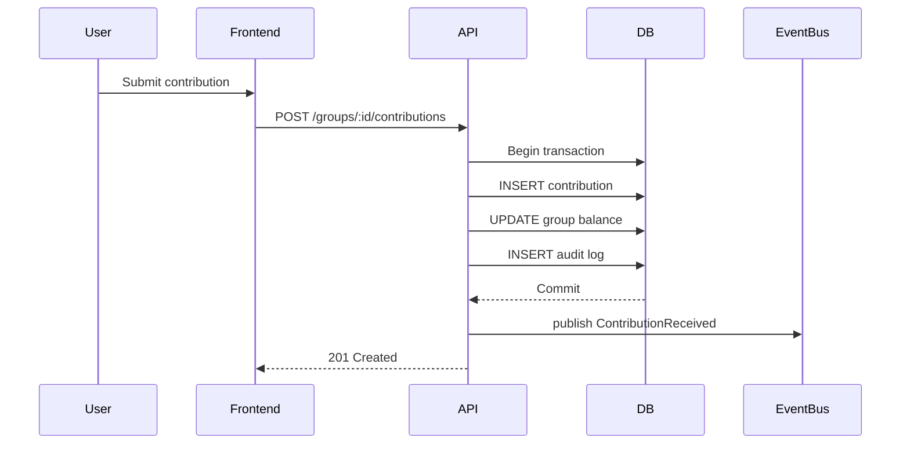
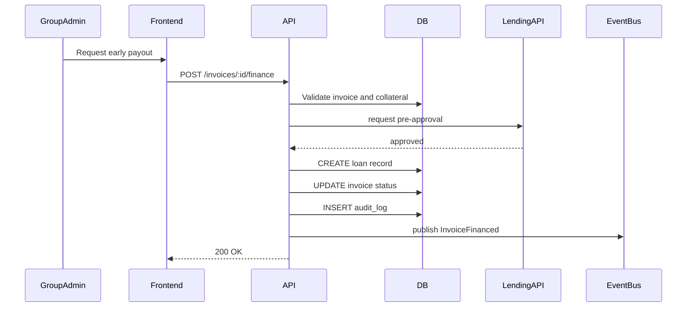

# Software Design Document (SDD)

## 1. Executive Summary

This document describes the first MVP for a financial infrastructure platform that upgrades informal groups and SMEs into creditworthy entities. The platform combines recordkeeping, governance, analytics, transaction plumbing, and financing integration to deliver financial legitimacy and access to capital.

---

## 2. Business and Economics Explained

### 2.1 Real-time invoice data so SMEs can get paid early without traditional underwriting

What it means:
- SMEs generate invoices for goods or services.
- The platform captures those invoices as structured data when they are created or approved.
- That real-time invoice data becomes the asset used to evaluate and finance a payment before the customer actually pays.

Why it matters:
- Traditional underwriting depends on historical credit scores, audited financials, and lengthy review.
- Invoice-based financing uses live receivables instead, so small businesses can get cash faster.

Example:
- A boda boda spare-parts dealer issues an invoice for KES 120,000 to a school.
- The app records the invoice, confirms the customer and due date, and offers 90% advance payment through a financing partner.
- The SME receives KES 108,000 immediately and the platform handles collection when the invoice matures.

Relevance:
- For SMEs and informal groups, this creates liquidity without waiting weeks.
- It also lowers risk for finance providers because the loan is tied to a specific invoice and payment promise.

### 2.2 Collateralized bank loans

What it means:
- A loan backed by an asset of value (cash, inventory, property, or receivables).
- If the borrower defaults, the lender can seize the collateral.

How it applies:
- The platform can aggregate group contributions, savings, and invoice receivables as collateral.
- A bank can underwrite a loan against the chama’s group savings or a portfolio of invoices.

Example:
- A chama has KES 500,000 in verified savings and KES 200,000 in approved invoices.
- A bank issues a collateralized loan for KES 400,000 using those verified assets.
- The platform provides the bank with digital evidence of balances and receivables.

### 2.3 Institutional investors (pension funds, mutual funds)

What it means:
- Large, regulated investors seek stable returns at scale.
- They prefer assets with reliable cash flow and measurable risk.

How it applies:
- The platform can package verified group portfolios, short-term loans, or invoice-backed receivables into investable products.
- Institutional investors can fund expansion capital or purchase receivables for predictable yield.

Example:
- A pension fund buys a tranche of short-term, insured advances against verified SME invoices.
- The fund earns interest while the platform provides underwriting and monitoring.

### 2.4 Money markets

What it means:
- Short-term debt market for highly liquid assets.
- Examples include treasury bills, commercial paper, and repurchase agreements.

How it applies:
- The platform’s invoice advances and collateralized receivables can behave like short-term money market assets.
- Funding partners can use the platform as a source of low-duration, high-turnover credit.

Example:
- A lending partner funds 30-day invoice advances and rolls them daily, similar to a money market instrument.

### 2.5 Financial legitimacy

What it means:
- Documented, verifiable financial behavior that can be trusted by lenders, suppliers, and regulators.

How it applies:
- The platform turns informal cash contributions, payment records, invoices, and governance actions into digital evidence.
- This visibility supports credit scoring, compliance, and trust.

Example:
- A chama with 18 months of consistent member contributions and timely loan repayments becomes eligible for a bank facility.

### 2.6 Information asymmetry

What it means:
- One party has more or better information than another.
- In finance, borrowers often know more about their true cash flow than lenders.

How it applies:
- The platform reduces information asymmetry by collecting and verifying member contributions, invoices, payments, and governance events.
- Better data means lenders can price risk more accurately, and members can access better terms.

Example:
- Instead of a lender guessing whether a group will repay, the platform shows actual deposit timing, default history, and cash flow trends.

---

## 3. Functionalities and Features

### 3.1 Turn informal financial groups into data-rich creditworthy entities

Core capability: Financial record engine.

Features:
- Group creation and identity registration
- Member profiles, roles, and linked mobile wallet IDs
- Contribution logging (cash, mobile money, bank transfers)
- Savings and loan ledger entries
- Invoice capture and receivable tracking
- Audit trail for every transaction
- Document storage for proof of receipts and contracts
- Periodic financial statements and balance snapshots

Value:
- Converts informal trust-based groups into structured entities with verifiable financial history.

### 3.2 Governance of respective groups (chamas)

Core capability: Roles, voting, rules implementation engine.

Features:
- Role definitions: chair, treasurer, secretary, member
- Voting workflows for group decisions
- Rule engine for penalties, contributions, loan approvals
- Automated reminders for contributions and repayments
- Enforcement actions for missed payments or rule violations
- Approval workflows for expenses and loans

Value:
- Standardizes group governance and enforces agreed rules transparently.

### 3.3 Analysis of records: financial insights + credit scoring

Core capability: Analytics and risk engine.

Features:
- Cashflow tracking dashboard
- Income vs expense analysis
- Member reliability scoring (payments timing, penalties, rule adherence)
- Group-level creditworthiness score
- Trend analysis, delinquency alerts, reserve ratios
- Scorecard output for lenders and financing partners

Value:
- Makes the group’s financial behavior machine-readable and trustable.

### 3.4 Financial transactions

Core capability: Payment and financing integration.

Features:
- M-Pesa payment initiation and reconciliation
- External lending API integration
- Invoice financing / early payouts
- Disbursement and repayment workflows
- Transaction notification channels
- Settlement and reconciliation engine

Value:
- Enables real money movement and capital access inside the same platform.

---

## 4. Implementation Concepts

### 4.1 ACID transactions

Definition:
- Atomicity, Consistency, Isolation, Durability.

How it will be used:
- Use database transactions for account balance updates, contributions, loan disbursements, and invoice settlements.
- Example: when a member contributes via M-Pesa, the system must credit the group balance, update the member ledger, and write the audit record in one atomic operation.

Why it matters:
- Prevents partial updates and keeps financial state correct.

### 4.2 Idempotency

Definition:
- The same operation can be repeated without changing the result after the first successful application.

How it will be used:
- For webhook handling from M-Pesa, external lending APIs, and payment callbacks.
- Use idempotency keys for repeated submit attempts.

Example:
- If a payment webhook is delivered twice, the system detects the same transaction ID and ignores the duplicate.

### 4.3 Event-driven design

Definition:
- System behavior is triggered by events instead of only synchronous request flows.

How it will be used:
- Publish events for contributions received, invoices approved, loans disbursed, repayments received.
- Use event consumers for notifications, analytics updates, scoring recalculation, and external system integration.

Example:
- `ContributionReceived` event updates dashboards, recalculates member reliability, and triggers a reminder engine.

### 4.4 Authentication and authorization: role-based authorization metric

Definition:
- Authentication verifies identity; authorization determines allowed actions.

How it will be used:
- Authenticate users with username/password, OTP, or mobile money login.
- Authorize actions based on roles, group membership, and resource context.

Example:
- Only a treasurer can approve a loan disbursement.
- A regular member can view the group ledger but not edit rules.

### 4.5 Role-based access control

Definition:
- Users are assigned roles, and roles grant permission sets.

How it will be used:
- Define permissions for each role: `create-group`, `log-contribution`, `approve-loan`, `view-reports`, `manage-members`.
- Enforce permissions at API and UI layers.

Example:
- The `chair` role can create proposals and start voting, while `member` can only cast votes.

### 4.6 Caching strategies (Redis)

Definition:
- Store frequently used or expensive-to-generate data in memory for faster access.

How it will be used:
- Cache lookup tables, reference data, credit score results, and aggregated dashboard metrics.
- Use Redis for session storage, rate limiting, and background job coordination.

Example:
- Cache the latest group creditworthiness score for 30 seconds to avoid recalculating on every dashboard view.

### 4.7 Error handling and logging

Definition:
- Capture failures clearly and persist logs for debugging and audit.

How it will be used:
- Return structured error responses from APIs.
- Log every exception with context, request metadata, and unique correlation IDs.
- Persist logs to a centralized store or use Heroku log drains.

Example:
- If an M-Pesa callback fails, write an error log, retry the webhook, and notify the operations queue.

### 4.8 Data validation

Definition:
- Ensure all input data is well-formed and within expected bounds.

How it will be used:
- Validate API request bodies, invoices, payment amounts, member IDs, and role assignments.
- Use schema validation libraries and database constraints.

Example:
- Reject a contribution request if the amount is negative or the member is not part of the target group.

---

## 5. MVP Features

- User authentication and group registration
- Group member management and roles
- Contribution logging and savings ledger
- Basic governance: roles, proposal creation, voting
- Invoice capture and receivable tracking
- Dashboard with cashflow and contribution history
- Member reliability scoring and simple group credit score
- M-Pesa integration for payments and reconciliation
- Early payout / invoice financing workflow
- API-level authorization and input validation
- Audit trail and transaction logging

---

## 6. Audience

Primary target users:
- Informal savings groups (chamas)
- Student groups and community cooperatives
- Micro and small enterprises (SMEs)

User needs:
- Simple recordkeeping for contributions and loans
- Transparent governance and rule enforcement
- Access to short-term cash and invoice financing
- Proof of financial behavior for future credit

---

## 7. System Flow Description

1. User registers and creates/joins a group.
2. Members are assigned roles and permissions.
3. Contributions are recorded through manual entry or M-Pesa callback.
4. Group rules are configured and proposals submitted.
5. Invoices or receivables are registered as assets.
6. Analytics compute cashflow, reliability scores, and creditworthiness.
7. Financing partners review the group profile and may offer early payouts or loans.
8. Transactions flow through external APIs and are reconciled in the ledger.
9. Events update dashboards, notifications, and audit logs.

---

## 8. Functional Requirements

- FR1: The system must allow user registration and secure login.
- FR2: The system must allow group creation, member invitations, and role assignment.
- FR3: The system must record contributions, loans, repayments, and invoices.
- FR4: The system must enforce role-based permissions for governance actions.
- FR5: The system must calculate member reliability and group credit scores.
- FR6: The system must integrate with M-Pesa and external lending APIs.
- FR7: The system must support invoice financing / early payouts.
- FR8: The system must provide audit trails for all financial events.
- FR9: The system must validate all input and reject invalid requests.
- FR10: The system must log errors and provide meaningful failure responses.

---

## 9. System Architecture

### 9.1 Tech stack

Backend:
- Node.js + Express or NestJS
- PostgreSQL
- Redis
- Sequelize / TypeORM / Prisma
- RabbitMQ / BullMQ for background jobs

Frontend:
- React or Next.js
- Tailwind CSS or Chakra UI
- Authentication flows with JWT / session cookies

Infrastructure:
- Heroku platform
- Heroku Postgres
- Heroku Redis
- Heroku Scheduler for background jobs
- M-Pesa API gateway
- External lending API integration
- Log drain / centralized logging

### 9.2 Database schema

Entities:
- users
- groups
- group_memberships
- roles
- permissions
- contributions
- invoices
- loans
- payments
- proposals
- votes
- score_history
- audit_logs

Example schema definitions:

```sql
CREATE TABLE users (
  id uuid PRIMARY KEY,
  email text UNIQUE NOT NULL,
  phone text UNIQUE NOT NULL,
  name text NOT NULL,
  password_hash text NOT NULL,
  created_at timestamptz DEFAULT now()
);

CREATE TABLE groups (
  id uuid PRIMARY KEY,
  name text NOT NULL,
  description text,
  legal_status text,
  created_at timestamptz DEFAULT now()
);

CREATE TABLE group_memberships (
  id uuid PRIMARY KEY,
  group_id uuid REFERENCES groups(id) ON DELETE CASCADE,
  user_id uuid REFERENCES users(id) ON DELETE CASCADE,
  role text NOT NULL,
  joined_at timestamptz DEFAULT now(),
  active boolean DEFAULT true
);

CREATE TABLE contributions (
  id uuid PRIMARY KEY,
  group_id uuid REFERENCES groups(id) ON DELETE CASCADE,
  user_id uuid REFERENCES users(id),
  amount numeric CHECK (amount > 0),
  channel text NOT NULL,
  external_reference text,
  status text NOT NULL DEFAULT 'pending',
  recorded_at timestamptz DEFAULT now()
);

CREATE TABLE invoices (
  id uuid PRIMARY KEY,
  group_id uuid REFERENCES groups(id) ON DELETE CASCADE,
  supplier text NOT NULL,
  customer text NOT NULL,
  amount numeric CHECK (amount > 0),
  due_date date NOT NULL,
  status text NOT NULL DEFAULT 'registered',
  created_at timestamptz DEFAULT now()
);

CREATE TABLE loans (
  id uuid PRIMARY KEY,
  group_id uuid REFERENCES groups(id) ON DELETE CASCADE,
  amount numeric CHECK (amount > 0),
  collateral jsonb,
  status text NOT NULL DEFAULT 'draft',
  disbursed_at timestamptz,
  due_date date,
  created_at timestamptz DEFAULT now()
);

CREATE TABLE audit_logs (
  id uuid PRIMARY KEY,
  entity text NOT NULL,
  entity_id uuid,
  action text NOT NULL,
  payload jsonb,
  user_id uuid,
  created_at timestamptz DEFAULT now()
);
```

### 9.3 Sequence diagrams

#### 9.3.1 Contribution recording flow



#### 9.3.2 Invoice financing flow



### 9.4 Deployment architecture (Heroku)

Components:
- Heroku web dyno for backend
- Heroku worker dyno for background jobs and event processing
- Heroku Postgres for relational data
- Heroku Redis for caching and job queues
- Add-on for external logging / monitoring
- Environment variables for API keys, DB URL, Redis URL, M-Pesa credentials

Flow:
- Frontend served from static hosting or a separate Next.js app on Heroku
- API receives request, authenticates, authorizes, validates input
- Business logic uses Postgres and Redis
- Background jobs handle reconciliation, score updates, and external webhooks

---

## 10. Detailed Design

### 10.1 Directory structure

```
/src
  /api
    /controllers
    /routes
    /middlewares
    /services
    /events
    /jobs
  /db
    /migrations
    /models
    /seeders
  /lib
    /auth
    /cache
    /validation
    /logging
  /config
  /utils
/tests
/public
/frontend
  /components
  /pages
  /hooks
  /services

README.md
SDD.md
```

### 10.2 API design

Authentication:
- POST /auth/register
- POST /auth/login
- POST /auth/logout
- POST /auth/refresh

Group management:
- POST /groups
- GET /groups/:id
- PATCH /groups/:id
- POST /groups/:id/members
- PATCH /groups/:id/members/:memberId

Contributions and payments:
- POST /groups/:id/contributions
- GET /groups/:id/contributions
- POST /payments/webhook/mpesa
- GET /groups/:id/balance

Invoices and financing:
- POST /groups/:id/invoices
- GET /groups/:id/invoices
- POST /invoices/:id/finance
- GET /invoices/:id/status

Governance:
- POST /groups/:id/proposals
- GET /groups/:id/proposals
- POST /proposals/:id/votes

Analytics and scoring:
- GET /groups/:id/dashboard
- GET /groups/:id/score
- GET /groups/:id/reports

Utility:
- GET /users/:id/profile
- GET /roles

### 10.3 Implementation notes

- Use middleware to enforce RBAC on protected routes.
- Use schema validation on every route with a library such as Joi, Zod, or Yup.
- Use Redis to cache computed dashboards, latest credit scores, and session metadata.
- Use a job queue for webhook processing, score recalculation, and external API retries.
- Use correlation IDs in headers for tracing requests across services.

---

## 11. Summary

This SDD defines a minimal yet meaningful MVP aligned to the business goal of converting informal financial groups into finance-ready entities. It covers the economics behind invoice financing, collateralized lending, institutional funding, and financial legitimacy, while mapping those business concepts to actual product features, implementation patterns, and a Heroku-based deployment architecture.
